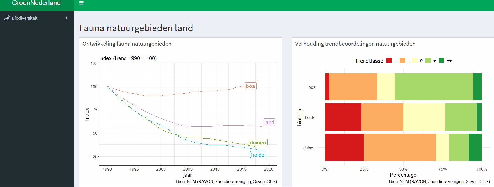

# green-netherlands (Work In Progress)
A shiny app to visualize 'green' datasets (e.g., biodiversity, green energy, etc.) from The Netherlands.  

**Links**
    * **Shinyapps:** .... 
    * **Github** https://github.com/a-koot/green-netherlands
    
**Data sources**
    * Biodiversity: NEM (RAVON, Sovon, CBS, Zoogdiervereniging)
